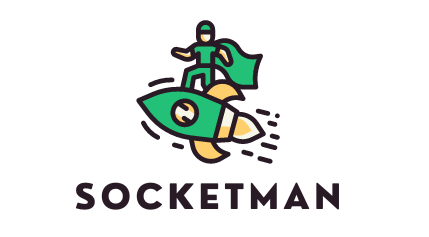

## 

A lightweight, minimalist GUI that allows developers to view, filter and emit WebSocket events in order to monitor and debug applications using Socket.IO

SocketMan is an open source devTool, accelerated under OSLabs.

## GitHub release (latest by date) GitHub last commit GitHub GitHub Repo stars GitHub issues

### 📖 **Getting Started** 📖

---

1. Download the [SocketMan](https://www.npmjs.com/package/socketman) npm package and follow the instructions for set up.

### **Features**

---

Listen Page 🎧

All events will be logged to the Listen page. Here events can be filtered by attributes including:

- Event Name
- Room
- Namespace
- Direction (Incoming, Outgoing, Test Emit)
- Socket ID

Emit Page 🚀

Test events on this page. Create an event by providing an event name. Optionally, add any desired payloads or a callback. Payloads must be provided in JSON format; a red indicator will appear on the argument if the JSON is invalid or does not match the user-defined type.

Save an event by giving it a name in the Save or Load Event section of the page and then clicking "Save Event". Saved events are added to local storage. To load an event, select one from the dropdown.

### **Want to Contribute?**

---

We welcome contributions to our open-source project, please feel free to make a PR or reach out to us via LinkedIn.

## **Contributors**

---

<table>
    <td align="center">
    <a href="https://github.com/kmccracko">
    
     
    <b>kmccracko</b>
    </a>
    </td>
    <td align="center">
    <a href="https://github.com/moodymango">
    
     
    <b>moodymango</b>
    </a>
    </td>
    <td align="center">
    <a href="https://github.com/nia-h">
    
     
    <b>nia-h</b>
    </a>
    </td>
    <td align="center">
    <a href="https://github.com/mar815">
    
     
    <b>mar815</b>
    </a>
    </td>
</table>
